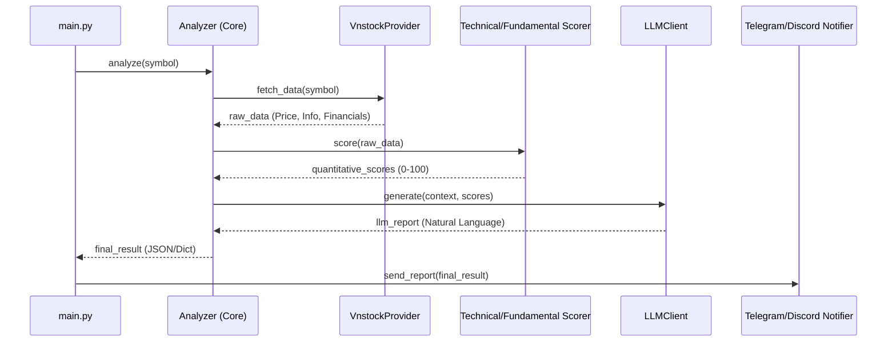

# Developer Guide - Architecture

This document provides a high-level overview of the VN Stock Daily Analysis system architecture, its components, and the data flow.

## System Overview

The system is designed to provide automated stock analysis for the Vietnamese stock market. it combines quantitative scoring (Technical & Fundamental) with qualitative LLM-based analysis to generate comprehensive reports delivered via messaging bots.

The core philosophy is a modular pipeline: **Fetch → Score → Analyze → Notify**.

## Core Flow

The standard execution flow is orchestrated by the `Analyzer` class. Below is a Mermaid sequence diagram showing the data flow:

## Component Roles

### Core Components
- **`main.py`**: The entry point. Handles CLI arguments, manages the watchlist, and selects the operational mode (Standard or Multi-Agent).
- **`src/core/analyzer.py` (`Analyzer`)**: The central orchestrator for the standard mode. It coordinates data fetching, scoring, and report generation.
- **`src/core/llm_client.py` (`LLMClient`)**: Interface for interacting with Large Language Models (via LiteLLM). It formats prompts and parses responses.

### Data & Market Layer
- **`src/data_provider/`**:
  - `VnstockProvider`: Primary data source using the `vnstock` library.
  - `FallbackRouter`: Ensures high availability by switching between providers if one fails.
- **`src/market/`**:
  - `CircuitBreaker`: Monitors price limits (ceiling/floor) and issues warnings.
  - `SectorMapping`: Maps symbols to their respective industry sectors.

### Scoring & Analysis
- **`src/scoring/`**:
  - `TechnicalScorer`: Evaluates trend, momentum, volume, and volatility.
  - `FundamentalScorer`: Evaluates profitability, leverage, efficiency, and valuation (including Piotroski F-Score).
- **`src/strategies/`**: Contains YAML-defined technical strategies that can be loaded dynamically.

### Agents (Multi-Agent Mode)
- **`src/agents/`**: Contains the multi-agent pipeline logic.
  - `TechnicalAgent`: Focuses on price action and indicators.
  - `RiskAgent`: Analyzes potential downsides and market risks.
  - `DecisionAgent`: Synthesizes all opinions into a final recommendation.
  - `AgentPipeline`: Orchestrates the sequence and communication between agents.

### Distribution
- **`src/notifier/`**:
  - `TelegramNotifier`: Sends formatted Markdown reports to Telegram.
  - `DiscordNotifier`: Sends reports to Discord channels via webhooks or bot interface.

### Utilities
- **`src/utils/`**: Shared logic for caching, validation, and configuration management.

## Directory Structure

| Directory | Responsibility |
|-----------|----------------|
| `src/agents/` | Multi-agent system components and pipeline. |
| `src/core/` | Main business logic, orchestrators, and LLM interfaces. |
| `src/data_provider/` | Data retrieval logic and provider abstractions. |
| `src/market/` | Market rules, sector data, and safety checks. |
| `src/news/` | News fetching and sentiment analysis (planned). |
| `src/notifier/` | Notification service implementations. |
| `src/scoring/` | Quantitative scoring engines. |
| `src/strategies/` | Configuration-based technical strategies. |
| `src/utils/` | Shared utilities, cache, and validators. |
