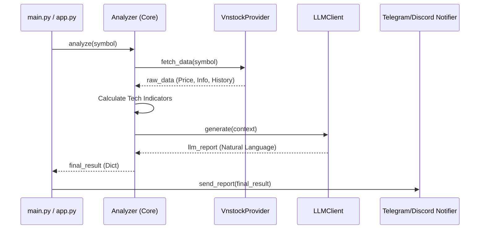

# Developer Guide - Architecture

This document provides a high-level overview of the VN Stock Daily Analysis system architecture, its components, and the data flow.

## System Overview

The system is designed to provide automated stock analysis for the Vietnamese stock market. It combines quantitative metrics with qualitative LLM-based analysis to generate comprehensive reports delivered via messaging bots.

The core philosophy is a modular pipeline: **Fetch → Process → Analyze → Notify**.

## Core Flow

The standard execution flow is orchestrated by the `Analyzer` class. Below is a Mermaid sequence diagram showing the data flow:

## Component Roles

### Core Components
- **`main.py`**: The CLI entry point. Handles arguments like `--symbol`, `--dry-run`, and `--agents`.
- **`app.py`**: The Streamlit-based web dashboard interface.
- **`src/core/analyzer.py` (`Analyzer`)**: The central orchestrator for simple analysis mode.
- **`src/agents/pipeline.py` (`AgentPipeline`)**: The orchestrator for Multi-Agent mode.
- **`src/core/llm_client.py` (`LiteLLMClient`)**: Interface for interacting with Large Language Models via `litellm`. It handles model routing and fallbacks.

### Data & Market Layer
- **`src/data_provider/`**:
  - `VnstockProvider`: Primary data source using the `vnstock` library.
  - `FallbackRouter`: Ensures high availability by switching between providers if one fails.
- **`src/market/`**:
  - `CircuitBreakerHandler`: Monitors price limits (ceiling/floor) based on reference prices.
  - `SectorMapping`: Maps symbols to their respective industry sectors.

### Analysis & Strategies
- **`src/strategies/`**: Contains YAML-defined technical strategies.
- **`src/agents/`**: Specialized AI agents (Technical, Risk, Decision) that use tools to perform deep-dive analysis in Multi-Agent mode.

### Distribution
- **`src/notifier/`**:
  - `TelegramNotifier`: Sends formatted Markdown reports to Telegram.
  - `DiscordNotifier`: Sends reports to Discord channels via webhooks.

### Utilities
- **`src/utils/`**: Shared logic for caching, validation, and configuration.

## Directory Structure

| Directory | Responsibility |
|-----------|----------------|
| `src/agents/` | Multi-agent system components and pipeline. |
| `src/core/` | Main business logic and orchestrators. |
| `src/data_provider/` | Data retrieval logic and provider abstractions. |
| `src/market/` | Market rules, sector data, and safety checks. |
| `src/notifier/` | Notification service implementations. |
| `src/strategies/` | Configuration-based technical strategies. |
| `src/utils/` | Shared utilities, cache, and validators. |
| `tests/` | Unit and integration tests. |
| `docs/` | System documentation. |
